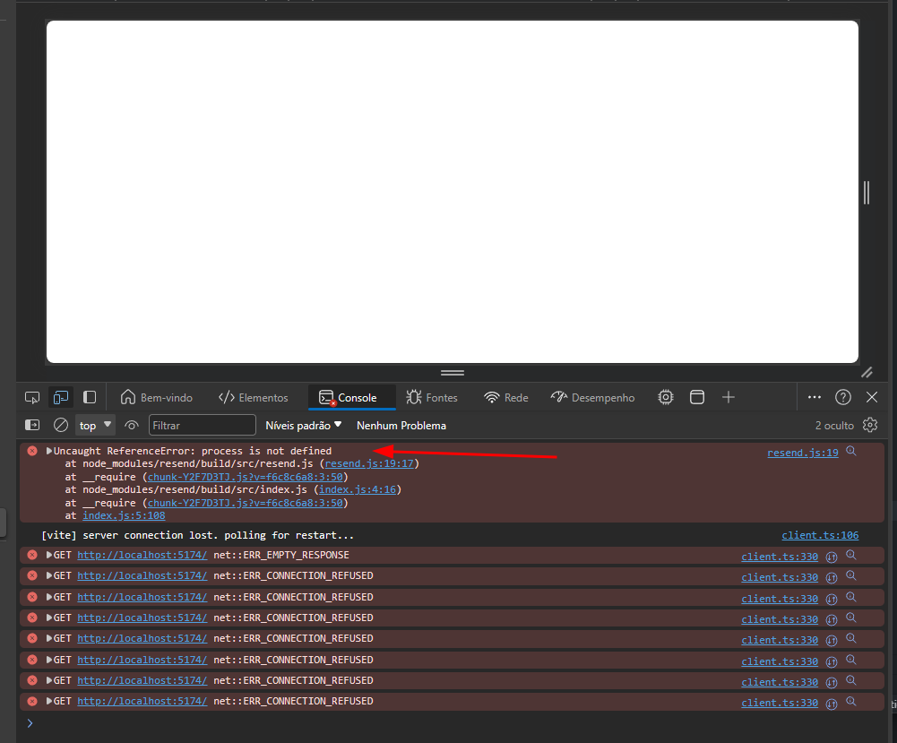

# resendViteEnvError

    Project created to reproduce the following issue:

    [issue](https://github.com/resend/resend-node/issues/237#issuecomment-1851138098)

## Project Setup

```sh
npm install
```

### Compile and Hot-Reload for Development

```sh
npm run dev
```


